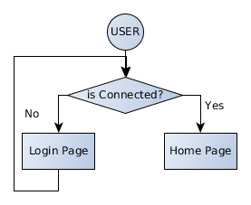

# Quizz Code Académie
## Sommaire
Dans le cadre de la Grande Ecole du Numérique, la fondation FACE a créé un organisme de formation : La Code Académie.

Cette mission est actuellement en cours pour la 3ème fois, et les formateurs, M. Erwann DUCLOS et M. Frédéric HANNOUCHE, nous a contacté afin de réaliser une application de type QUIZZ. Cette application leur permettra de réaliser la première étape du processus de recrutement : la pré-sélection des apprenants avant leur admission au sein de l'école. 

## Définition globale du projet
L'application a pour but d'être accessible sur internet pour l'ensemble des futurs apprenants de la Code Académie. 
Il est attendu de pouvoir ajouter de nombreux types de contenus, divers et variés afin de pouvoir tester un ensemble relativement vaste des aptitudes des candidats. 
Un compte administrateur permettra de définir les personnes disposant d'un compte au sein du site, ainsi que pour administrer les questions du quizz.

## Définition de la cible
La cible de cette application, sont les personnes souhaitant s'inscrire à la prochaine session de la Code Académie. Il s'agit donc d'hommes et de femmes, entre 16 et 55 ans.

## Définition du commanditaire
Le commanditaire du présent projet est l’association FACE (Fondation Agir Contre l'Exclusion) qui souhaite avoir cette application pour l'une de leurs missions : la Code Académie.
La Code Académie est un dispositif de formation mis en place dans le cadre du projet gouvernemental de la Grande école du numérique. Il s'agit d'une formation qui permet l'apprentissage du développement web/mobile. Cette formation proposée par la Fondation Agir Contre l'Exclusion de Rennes, suit la pédagogie basée sur la méthode du "Learning by doing". Spécialement orientée vers les travaux pratiques, cette formation permet l'apprentissage des bases du développement web et des langages tels que HTML5/CSS3, Javascript et PHP et vise à former les apprenants au métier de développeur web junior.

## Charte Graphique
L'application respectera la charte graphique ci-jointe.
cf. [pièce jointe](./annexes/charte_graphique).

## Arborescence du site
### Utilisateur non connecté

Un utilisateur non connecté ne doit pas pouvoir avoir accès à l'application. Il doit être constamment redirigé vers la page de connexion.

### Utilisateur connecté

Un utilisateur connecté doit pouvoir avoir accès à l'ensemble des quizz qui lui sont affectés. Il aura la possibilité de se connecter par le biais de son adresse email / mot de passe.

## Description d'un quizz

Un quizz est composé d'un titre, d'une durée, d'une description et de plusieurs questions.
Une première page sera affichée permettant d'afficher la description du quizz. Une mise en garde sera réalisée  afin de préciser à l'utilisateur qu'une fois qu'il aura commencé à réaliser le quizz il ne pourra plus revenir en arrière et  que son temps sera compté. 

Une fois que l'utilisateur accepte de réaliser le quizz, les questions lui seront affichées une à une. L'utilisateur n'aura pas la possibilité de revenir en arrière. 

Lorsque l'utilisateur a fini de répondre aux questions du formulaire ou lorsque le temps prévu sera écoulé, les résultats seront sauvegardés, et un message sera affiché à l'utilisateur lui mentionnant que son quizz est fini. 
Il aura la possibilité de rajouter un dernier commentaire. 

## Description d'une question
Toute question du quizz sera composée d'une question et de 4 réponses.
La question ainsi que les réponses ne seront pas forcément textuelles, il doit être possible d'avoir les combinaisons suivantes : 

+ Questions : Texte / Image / Vidéo / Document / Son
+ Réponses  : Texte / Image / Son 

Si la question est un document, ce dernier devra s'ouvrir dans un autre onglet.

### Administration
Uniquement l'administrateur aura la possibilité de créer, modifier, supprimer des questions. Chaque question aura un tag (champ obligatoire). 

## Description d'un tag
Un tag consiste à catégoriser une/des questions. Un ensemble de critères d'évaluations doit être pris en compte avant l'admission au sein de la Code Académie.  Par exemple, des tests sur la vision du candidat (bonne différenciation des couleurs) ou encore sur ses capacités de lecture sont de mise. 

## Compte utilisateur
Un compte utilisateur contiendra les informations suivantes : 

 * Nom (Texte <50 char)
 * Prénom (Texte <50 char)
 * Genre (Homme/Femme/Autre)
 * Email (Texte <50 char)
 * MotDePasse
 * QPV
 * RQTH (Oui / Non)
 * Actif (Oui / Non)
 * Requiers un tiers temps (Oui / Non)

Le champ "Requiers un tiers temps" ne pourra être actif que si le candidat a le champ RQTH à Oui.
Nulle vérification n'est attendue au niveau du mot de passe. 
Uniquement les administrateurs auront la possibilité de créer des comptes utilisateurs. Les personnes connectées auront la possibilité de modifier leurs comptes respectifs. Ils n'auront pas la possibilité de modifier leurs adresses mail.  

## Page de statistiques
L'administrateur aura pour chaque compte utilisateur du site, des statistiques de réussite du quizz. 

Il doit être possible de visualiser le taux de réussite général. Ainsi que de pouvoir voir en détail les catégories (tag) et la réussite dans chaque catégorie. 

Il doit également être possible de pouvoir visualiser le temps total mis par le candidat pour répondre aux questions. Ainsi que leurs commentaires.

## Contraintes techniques
L'application sera développée en méthode agile par la Code Académie. Le commanditaire fera partie intégrante du processus de livraison. Pour chaque sprint, une version Beta sera livrée au client. 

### Responsive
Cette application devra pouvoir s'adapter à différentes tailles d'écran.
Pour les "Utilisateurs", l'interface doit être accessible et fonctionnelle du mobile au grand écran.
Pour la partie "Administration", l'interface doit être seulement disponible pour tablette en horizontal et supérieur. Un message indiquant cette contrainte sera indiqué pour les tailles inférieures. 

### Compatibilité navigateurs
Il est attendu d'avoir une application compatible avec les navigateurs suivantes : 

 * Google Chrome (ou Chromium)
 * Mozilla Firefox

# Consignes

## Étapes
Ce projet se déroulera en deux étapes : préparation et réalisation

L'étape de préparation sera à faire chez vous, c'est une phase de réflexion et d'organisation.

Ce projet sera réalisé en appliquant une méthodologie SCRUM, vous devez pour le lundi 28 avoir une organisation prête façon SCRUM (définition des sprints, backlog, tableau de répartition des tâches, choix du scrumaster...).

Vous aurez ensuite 4 jours en formation + 1 WE pour développer le projet et le rendre.

## Rendu
Livraison attendue le Lundi 4 Février à 16h45.
Mais des rendus intermédiaires vont avoir lieu, en fonction de la configuration de vos sprints.

## Groupes
Vous travaillerez en groupe de 4 : 
1. Nora / Julien / Honorin / Régis
2. Zoubair / Quentin / Ewilan / Ann-Katell
3. Emmanuelle / Martin / Delphine / Jean-Marc
4. Maysam / Philippe / Joanna / Carol
5. Meuslem / Gaëtan / Lionel / Maëva
6. Alice / Hugo / Audrey
